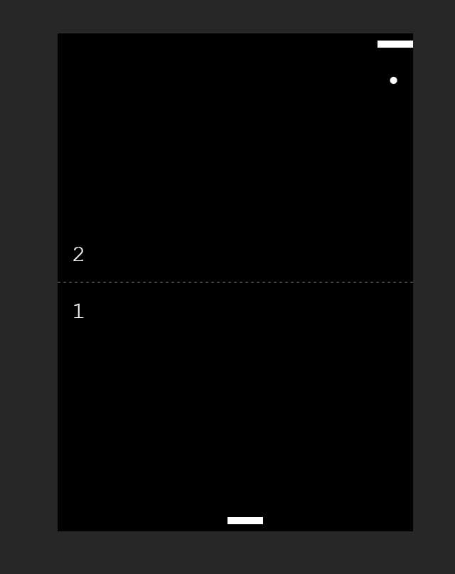

# Pong Game

This project is part of the **"JavaScript Web Projects: 20 Projects to Build Your Portfolio"** course. It’s a browser-based recreation of the classic **Pong** arcade game, built entirely with **vanilla JavaScript**, **HTML Canvas**, and **CSS**.

The goal of this project is to strengthen understanding of **canvas drawing**, **game loops**, and **event handling** in JavaScript.

---
## Features

- Classic **Pong gameplay** (player vs. computer)
- Real-time rendering using the **HTML5 Canvas**
- Simple **AI opponent** logic
- Score tracking for both players
- Game resets automatically after each round
- Responsive design – works across different screen sizes

---
## Preview

[demo](https://abdo-rabea.github.io/pong)

---
## What I Learn

- Drawing shapes and text with the **HTML Canvas API**
- Creating a **game loop** with `requestAnimationFrame`
- Handling **keyboard input events** for paddle movement
- Implementing basic **collision detection**
- Writing simple **AI logic** for the computer paddle
- Managing **game state** (ball speed, direction, scoring)
---
## Tech Stack

- **HTML5** (Canvas)
- **CSS3**
- **JavaScript (ES6+)**
